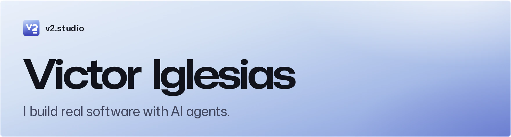
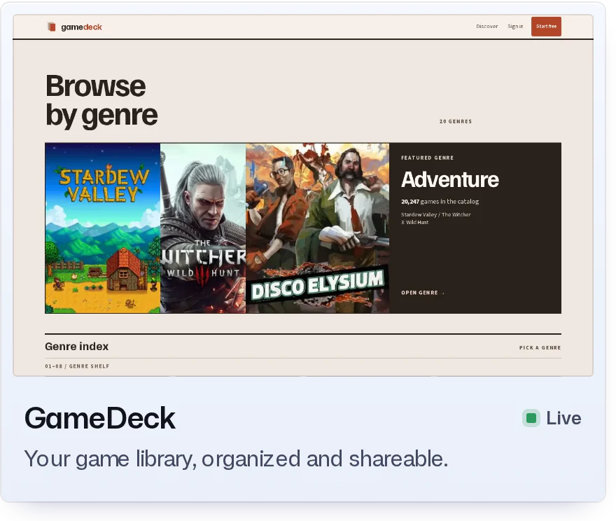
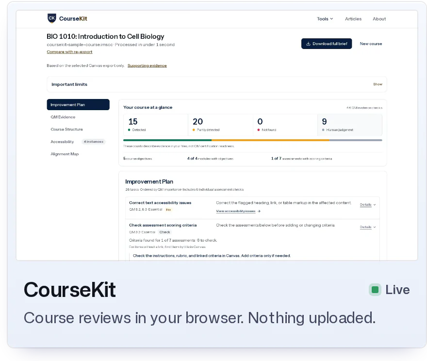
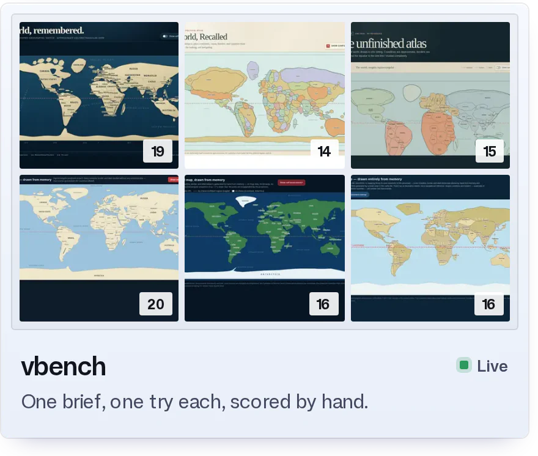
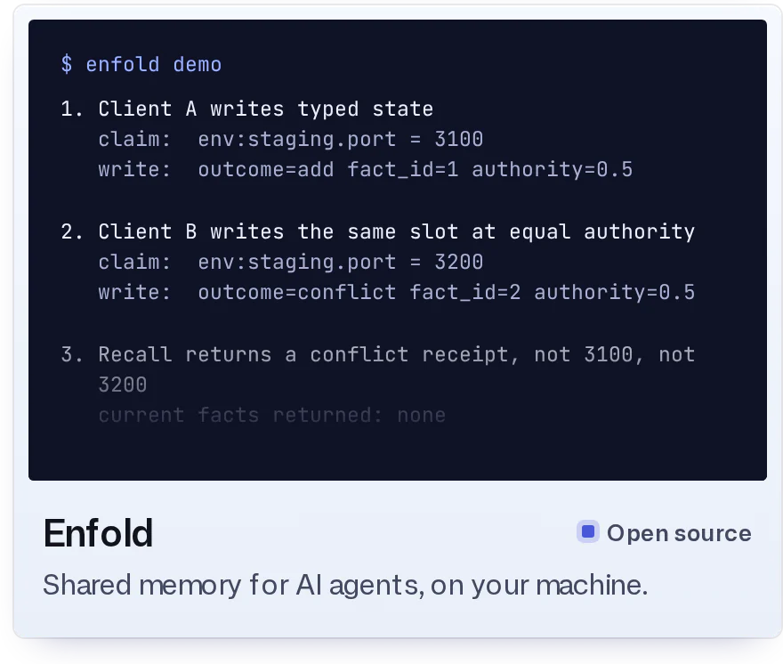

<picture><source media="(prefers-color-scheme: dark)" srcset="assets/header-dark.webp"></picture>

<a href="https://v2.studio"><picture><source media="(prefers-color-scheme: dark)" srcset="assets/link-site-dark.png"></picture></a> <a href="https://v2.studio/victor-iglesias-resume.pdf"><picture><source media="(prefers-color-scheme: dark)" srcset="assets/link-resume-dark.png"></picture></a> <a href="https://www.linkedin.com/in/victoriglesiascs/"><picture><source media="(prefers-color-scheme: dark)" srcset="assets/link-linkedin-dark.png"></picture></a> <a href="https://x.com/victorv2i"><picture><source media="(prefers-color-scheme: dark)" srcset="assets/link-x-dark.png"></picture></a>

<a href="https://gamedeck.gg"><picture><source media="(prefers-color-scheme: dark)" srcset="assets/card-gamedeck-dark.webp"></picture></a><a href="https://coursekit.tools"><picture><source media="(prefers-color-scheme: dark)" srcset="assets/card-coursekit-dark.webp"></picture></a><a href="https://v2.studio/vbench"><picture><source media="(prefers-color-scheme: dark)" srcset="assets/card-vbench-dark.webp"></picture></a><a href="https://github.com/victorv2i/enfold"><picture><source media="(prefers-color-scheme: dark)" srcset="assets/card-enfold-dark.webp"></picture></a>

### More

- **[Enkeep](https://github.com/victorv2i/enkeep)** · A Markdown editor in your browser.
- **[civil3d-ai-starter](https://github.com/victorv2i/civil3d-ai-starter)** · Describe a Civil 3D command in plain English. Claude writes, builds and loads it.
- **[Upstream fixes](https://v2.studio/upstream)** · 2 merged in [odysseus](https://github.com/odysseus-dev/odysseus/pulls?q=is%3Apr+author%3Avictorv2i) (87k stars), 4 open in [hermes-agent](https://github.com/NousResearch/hermes-agent/pulls?q=is%3Apr+author%3Avictorv2i) (249k stars).
